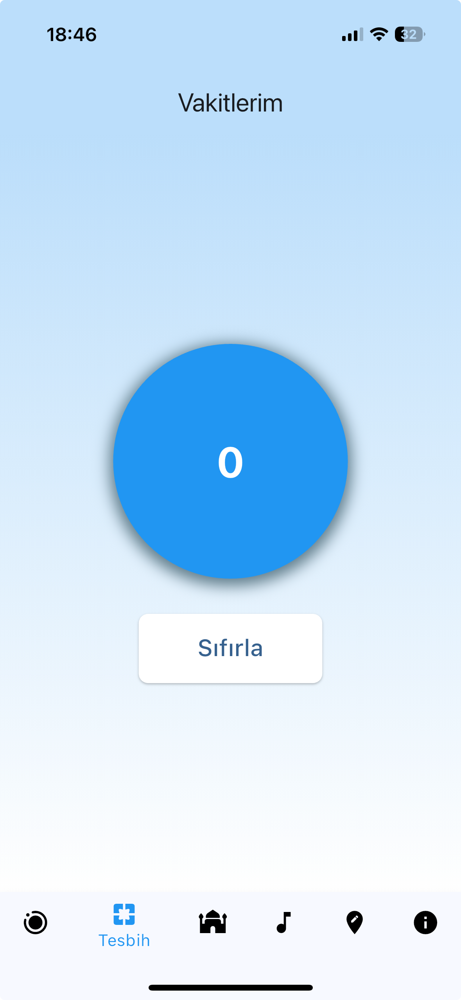
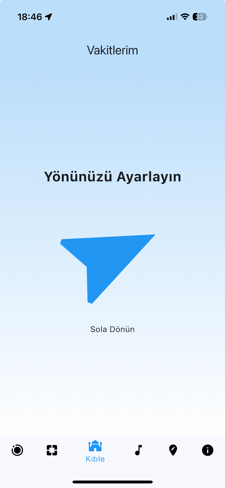
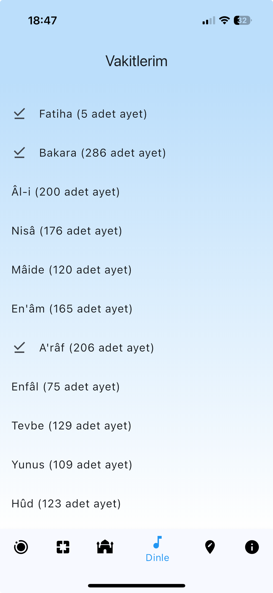
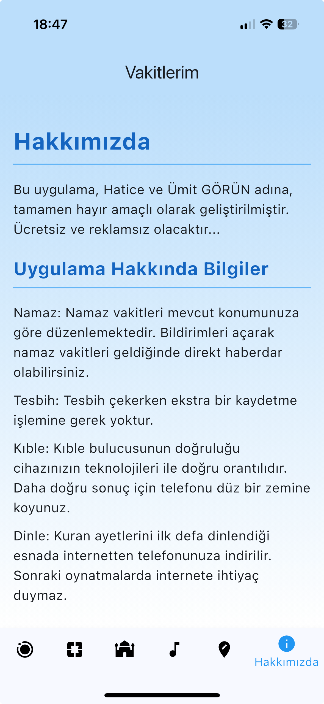

# Kuran Mealleri - Sesli Kuran Projesi

Bu proje, Kuran-ı Kerim'in çeşitli surelerinin sesli meallerini içeren bir koleksiyondur. Ses dosyaları, mobil uygulama geliştirme amacıyla GitHub üzerinde barındırılmaktadır.

## 📱 Mobil Uygulama

Bu ses dosyaları **[Vakitlerim](https://apps.apple.com/tr/app/vakitlerim/id6450887001?l=tr)** mobil uygulamasında kullanılmaktadır.

### 🎯 Uygulama Özellikleri

- **📅 Namaz Vakitleri:** Diyanet'in resmi namaz vakitlerini gösterir
- **🧭 Kıble Pusulası:** Doğru yöne yönlendirir
- **📿 Dijital Tesbih:** Zikirlerinizi kolayca sayın
- **🎧 Sesli Kuran:** Offline Kuran dinleme özelliği
- **🌍 Konum Bazlı:** İstediğiniz yerdeki namaz vakitleri
- **🚫 Reklamsız:** Kesintisiz ibadet deneyimi

### 📱 Ekran Görüntüleri

| Özellik | Açıklama |
|---------|----------|
|  | **Namaz Vakitleri** - Güncel namaz vakitlerini görüntüleme |
|  | **Dijital Tesbih** - Zikir sayma uygulaması |
|  | **Kıble Pusulası** - Doğru yöne yönlendirme |
|  | **Kuran Dinleme** - Sesli Kuran dinleme sayfası |
|  | **Konum Bazlı Vakitler** - İstediğiniz yerdeki namaz vakitleri |
|  | **Hakkımızda** - Uygulama bilgileri |

### 📲 App Store

**[Vakitlerim](https://apps.apple.com/tr/app/vakitlerim/id6450887001?l=tr)** uygulamasını App Store'dan indirebilirsiniz.

**Uygulama Özellikleri:**
- ⭐ 4.8/5 puan (12 oy)
- 📱 iPhone, iPad, Mac uyumlu
- 🆓 Ücretsiz
- 🚫 Reklamsız
- 📦 32.5 MB boyut

## 📁 Proje Yapısı

Proje, her sure için ayrı klasörler halinde organize edilmiştir. Tüm klasör isimleri küçük harfli İngilizce karakterlerle yazılmıştır:

### 📂 Klasör Organizasyonu

```
Kuran Mealleri/
├── 001-fatiha/           # Fâtiha Suresi
├── 002-bakara/           # Bakara Suresi (12 parça)
├── 004-nisa/             # Nisâ Suresi (6 parça)
├── 036-yasin/            # Yasin Suresi (2 parça)
├── 038-sad/              # Sâd Suresi (2 parça)
├── 039-zumer/            # Zümer Suresi
├── 049-hucurat/          # Hucurât Suresi
├── 060-mumtehine/        # Mümtehine Suresi
├── 061-saff/             # Saff Suresi
├── 062-cuma/             # Cum'a Suresi
├── 063-munafikun/        # Münâfikûn Suresi
├── 065-talak/            # Talâk Suresi
├── 066-tahrim/           # Tahrîm Suresi
├── 086-tarik/            # Târık Suresi
├── 091-sems/             # Şems Suresi
├── 093-duha/             # Duhâ Suresi
├── 094-insirah/          # İnşirah Suresi
├── 095-tin/              # Tin Suresi
├── 097-kadir/            # Kadir Suresi
├── 098-beyyine/          # Beyyine Suresi
├── 099-zilzal/           # Zilzâl Suresi
├── 100-adiyat/           # Âdiyât Suresi
├── 101-karia/            # Kâri'a Suresi
├── 102-tekasur/          # Tekâsür Suresi
├── 103-asr/              # Asr Suresi
├── 104-humeze/           # Hümeze Suresi
├── 105-fil/              # Fil Suresi
├── 106-kureys/           # Kureyş Suresi
├── 107-maun/             # Maun Suresi
├── 108-kevser/           # Kevser Suresi
├── 109-kafirun/          # Kâfirûn Suresi
├── 110-nasr/             # Nasr Suresi
├── 111-tebbet/           # Tebbet Suresi
├── 112-ihlas/            # İhlâs Suresi
├── 113-felak/            # Felak Suresi
└── 114-nas/              # Nâs Suresi
```

### 📄 Dosya İsimlendirme Sistemi

Her klasör içindeki dosyalar sıralı numaralarla isimlendirilmiştir:

- **Tek dosyalı sureler:** `1.mp3`
- **Çok parçalı sureler:** `1.mp3`, `2.mp3`, `3.mp3`, ... (sıralı)

**Örnekler:**
- `001-fatiha/1.mp3` - Fâtiha Suresi
- `002-bakara/1.mp3` - Bakara Suresi 1. Parça
- `002-bakara/2.mp3` - Bakara Suresi 2. Parça
- `002-bakara/12.mp3` - Bakara Suresi 12. Parça
- `036-yasin/1.mp3` - Yasin Suresi 1. Parça
- `036-yasin/2.mp3` - Yasin Suresi 2. Parça

## 📊 İçerik İstatistikleri

- **Toplam Sure Sayısı:** 36 farklı sure
- **Toplam Ses Dosyası:** 53 adet MP3 dosyası
- **Dosya Formatı:** MP3
- **Dil:** Türkçe Mealler
- **Klasör İsimlendirme:** Küçük harfli İngilizce karakterler
- **Dosya İsimlendirme:** Sıralı numaralar (1.mp3, 2.mp3, ...)

### 📈 Sure Detayları

| Sure No | Sure Adı | Dosya Sayısı | Dosya İsimleri |
|---------|----------|--------------|----------------|
| 1 | Fâtiha | 1 | 1.mp3 |
| 2 | Bakara | 12 | 1.mp3 - 12.mp3 |
| 4 | Nisâ | 6 | 1.mp3 - 6.mp3 |
| 36 | Yasin | 2 | 1.mp3, 2.mp3 |
| 38 | Sâd | 2 | 1.mp3, 2.mp3 |
| 39 | Zümer | 1 | 1.mp3 |
| 49 | Hucurât | 1 | 1.mp3 |
| 60 | Mümtehine | 1 | 1.mp3 |
| 61 | Saff | 1 | 1.mp3 |
| 62 | Cum'a | 1 | 1.mp3 |
| 63 | Münâfikûn | 1 | 1.mp3 |
| 65 | Talâk | 1 | 1.mp3 |
| 66 | Tahrîm | 1 | 1.mp3 |
| 86 | Târık | 1 | 1.mp3 |
| 91 | Şems | 1 | 1.mp3 |
| 93 | Duhâ | 1 | 1.mp3 |
| 94 | İnşirah | 1 | 1.mp3 |
| 95 | Tin | 1 | 1.mp3 |
| 97 | Kadir | 1 | 1.mp3 |
| 98 | Beyyine | 1 | 1.mp3 |
| 99 | Zilzâl | 1 | 1.mp3 |
| 100 | Âdiyât | 1 | 1.mp3 |
| 101 | Kâri'a | 1 | 1.mp3 |
| 102 | Tekâsür | 1 | 1.mp3 |
| 103 | Asr | 1 | 1.mp3 |
| 104 | Hümeze | 1 | 1.mp3 |
| 105 | Fil | 1 | 1.mp3 |
| 106 | Kureyş | 1 | 1.mp3 |
| 107 | Maun | 1 | 1.mp3 |
| 108 | Kevser | 1 | 1.mp3 |
| 109 | Kâfirûn | 1 | 1.mp3 |
| 110 | Nasr | 1 | 1.mp3 |
| 111 | Tebbet | 1 | 1.mp3 |
| 112 | İhlâs | 1 | 1.mp3 |
| 113 | Felak | 1 | 1.mp3 |
| 114 | Nâs | 1 | 1.mp3 |

## 🎯 Kullanım Amacı

Bu ses dosyaları aşağıdaki amaçlar için kullanılabilir:

- 📱 **Mobil Uygulama Geliştirme:** Kuran okuma uygulamaları
- 🎧 **Sesli Kuran Dinleme:** Offline dinleme için
- 📚 **Eğitim Materyali:** Kuran öğretimi için
- 🔄 **API Entegrasyonu:** Web servisleri için

## 🚀 Kurulum ve Kullanım

### GitHub'dan İndirme

```bash
git clone https://github.com/[kullanici-adi]/kuran-mealleri.git
cd kuran-mealleri
```

### Mobil Uygulama Entegrasyonu

Ses dosyalarını mobil uygulamanızda kullanmak için:

1. İlgili klasörden MP3 dosyalarını indirin
2. Uygulamanızın assets klasörüne ekleyin
3. Ses çalma fonksiyonlarınızı yapılandırın

**Örnek Kullanım:**
```javascript
// Fâtiha Suresi için
const fatihaAudio = require('./001-fatiha/1.mp3');

// Bakara Suresi 5. parça için
const bakaraPart5 = require('./002-bakara/5.mp3');

// Yasin Suresi 2. parça için
const yasinPart2 = require('./036-yasin/2.mp3');
```

## 📝 Notlar

- Tüm dosyalar MP3 formatındadır
- Klasör isimleri küçük harfli İngilizce karakterlerle yazılmıştır
- Dosya isimleri sıralı numaralarla (1.mp3, 2.mp3, ...) düzenlenmiştir
- Bakara Suresi 12 parça halinde bölünmüştür
- Yasin ve Sâd sureleri 2'şer parça halinde bölünmüştür
 - Nisâ Suresi 6 parça halinde bölünmüştür

## 🔧 Teknik Detaylar

- **Kodlama:** MP3
- **Bit Rate:** Değişken
- **Sample Rate:** 44.1 kHz
- **Kanal:** Stereo/Mono (değişken)
- **Klasör İsimlendirme:** Küçük harfli İngilizce karakterler
- **Dosya İsimlendirme:** Sıralı numaralar

## 👨‍💻 Geliştirici

**Beren Kuday GÖRÜN**

- 📱 [Vakitlerim Uygulaması](https://apps.apple.com/tr/app/vakitlerim/id6450887001?l=tr)
- 🌐 [Diğer Uygulamalar](https://apps.apple.com/developer/beren-kuday-gorun/id6450887000)

## 📞 İletişim

Bu proje ile ilgili sorularınız için:
- GitHub Issues kullanabilirsiniz
- Pull Request gönderebilirsiniz

